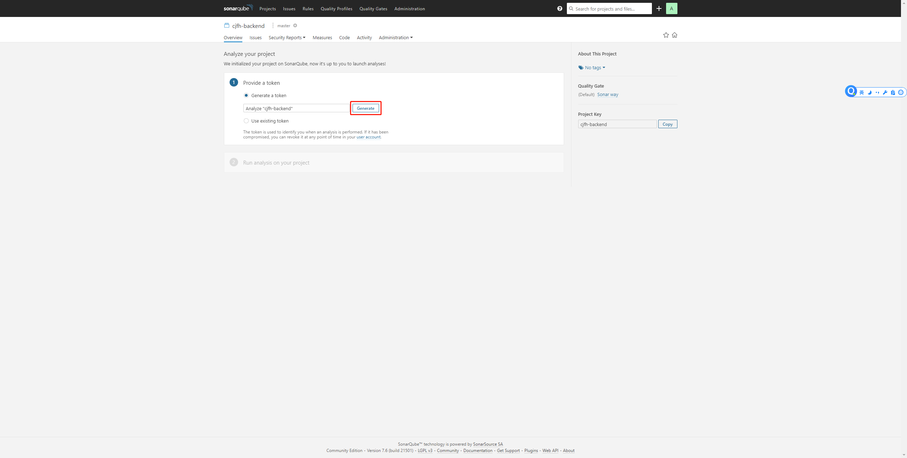

# 代码提交准则

### 代码规范

#### 1. 阿里编程规范

- 开发工程师在开发代码的时候，需要严格遵循阿里编程规范，除非团队内部达成一定程度的约定。

- 具备评审资格的工程师在评审代码的时候，需要对代码进行检查，同样遵循相同版本的阿里编程规范。

#### 2. Sonarqube静态检查

开发工程师和具备评审资格的工程师均需要对某个分支的代码进行静态检查，使用方法如下：

登录目前公司的sonarqube系统，当前地址为：http://172.16.55.10:19000，帐号密码均为: admin

会要求提供一个项目的key，输入

点击Generate生成一个token

点击continue以及语言类型还有构建方式，会生成一段maven命令

可以在本地项目目录下执行这段maven命令，正常执行完毕后会看到如下提示，告知在sonarqube中生成了静态检查的审计报表。

此时，可以到sonarqube中查看相关报表。

在发起合并请求之前，保证 Blocker, Critical, Major 的问题至少要解决掉。